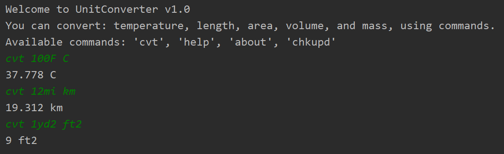

<!--Version-1.0.0-->

# UnitConverter

**A simple unit conversion command line app made with Kotlin**

***



## Download
Download [UnitConverter-v1.0.0.jar]() and run it with the following command.

```
 java -jar UnitConverter-v1.0.0.jar
```

***

## Available Units

<details>
<summary>Temperature</summary>
* 'F', 'C', 'K'
</details>

<details>
<summary>Length</summary>
* 'mm', 'cm', 'm', 'km', 'in', 'ft', 'yd', 'mi'
</details>


<details>
<summary>Area</summary>
* 'ac', 'mm2', 'cm2', 'm2', 'ha', 'km2', 'in2', 'ft2', 'yd2', 'mi2'
</details>


<details>
<summary>Volume</summary>
* 'mm3', 'ml', 'l', 'm3', 'km3', 'in3', 'ft3', 'yd3', 'mi3', 'gal', 'qt', 'pt', 'c', 'floz', 'tbsp', 'tsp', 'impgal', 'impqt', 'imppt', 'impc', 'impfloz', 'imptbsp', 'imptsp'
</details>


<details>
<summary>Mass</summary>
* 'mg', 'g', 'kg', 't', 'lb', 'oz', 'ton', 'impton', 'st', 'impst'
</details>

***

## Usage

### Syntax:
```
cvt <<val><unit1>> <unit2>
```

### Examples:
```
cvt 95F C
// 35 C

cvt 1ft cm
// 30.48 cm

cvt 1yd2 ft2
// 9 ft2

cvt 500ml l
// 0.5 l

cvt 1lb kg
// 0.4536 kg
```